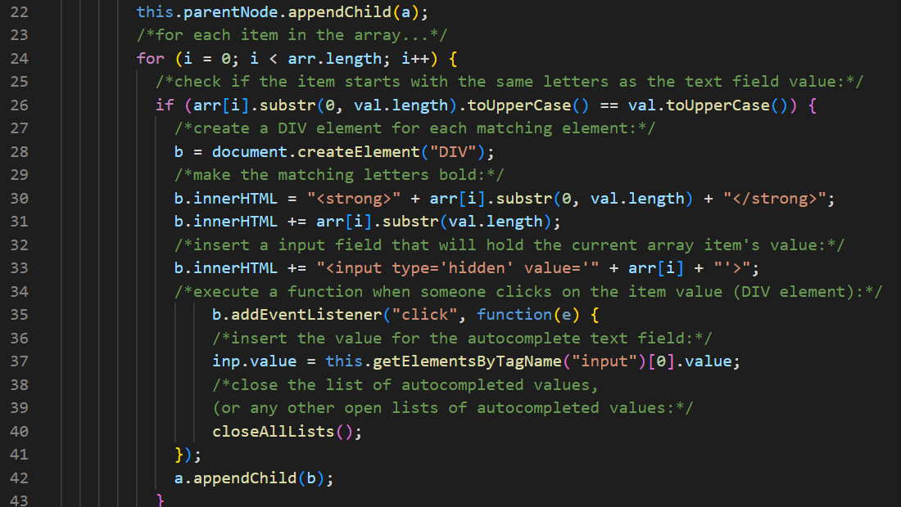
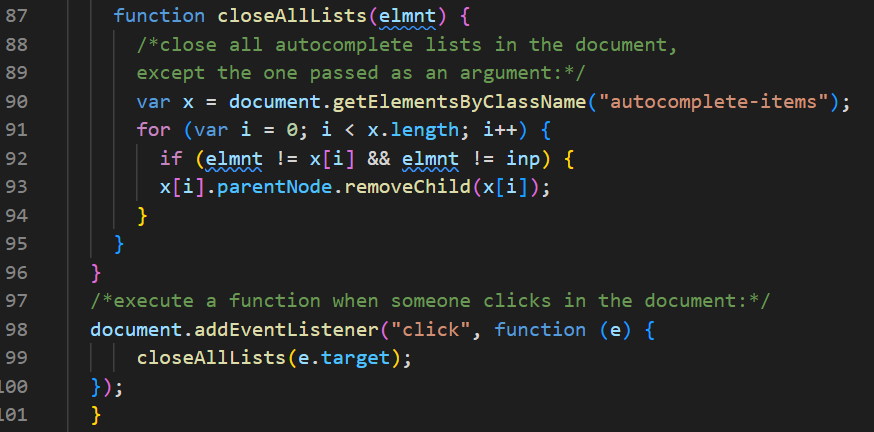

## Whats My Jam

## Purpose
Build and awesome app!
    Whats My Jam! allows local and global music experience to most popular libraries 
    of songs that fans would like to stream, enjoy and also look up coming concerts. The 
    only thing you need is just a click of a button and then you my friend will be 
    enjoying all your favorites in one place.
    
## Autocomplete Feature
To help the user with their selections we utilized a search bar with an autocomplete function. This way we could also control the user's inputs to ensure that our website and the search functions worked properly. 

We housed all of our genre choices in an array.

When a letter was pressed the function would generate additional rows to house the selections based on the first letter. If the user deleted their input then the rows would also be removed. 

As a cool feature we had the created rows be responsive to the user's arrow keys. As the keys for up and down were pressed the selection would be highlighted with blue to alert the user of what they were highlighting. We were able to restyle this feature to have the colors cycle through and not stay static. 

From there they could mouse click or hit 'enter' to add the completed option into the search bar. If the user just used their mouse from the beginning, however, there will be no blue highlighting.

To make the UI a little cleaner we also made all of the added rows disappear when the user clicked out of the search bar selections. 

## Buttons Generate Radio Station List
To get our buttons to generate the list of radio stations of the genre selected, we started with pulling in and referencing all of the buttons by the class.

Once we had the buttons, we used an onclick event listener to run the function. In the function we are grabbing the id of the button and saving it as the variable genre_id. This id is then plugged into the fetch request to complete the url and help us get the correct radio stations that we needed. 

We created a table as well as rows and cells to house our data. We used a for loop to generate a list of ten radio stations. We made sure to clear the container housing the table before creating and adding in the values to the table rows. This prevented additional tables from being added to the display. We grabbed the name of the radio stations from the api by referencing var stationName = response.data[i].name. Our original intent was to have the corresponding url be included in the link so the user would be able to listen to the station right away but the api was presenting us with a blank array instead. To get around this we used a separate web page and added in the station name (var stationName) and linked the user to a search over there. 

##api's
